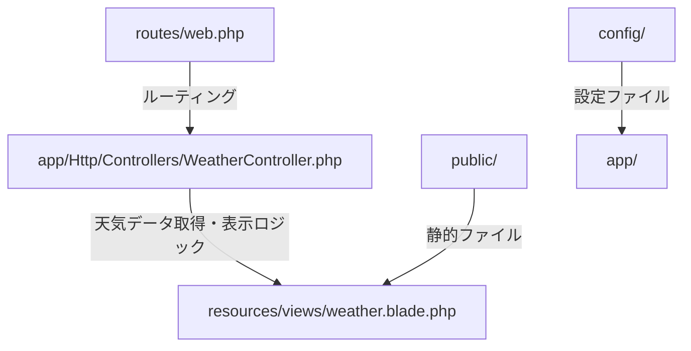

# codespace-laravel 設計・仕様書

## 概要

codespace-laravelは、Laravelフレームワークを用いたWebアプリケーションのサンプルプロジェクトです。Open-Meteo APIを活用し、東京の1週間分の天気予報を表とグラフで表示する機能を持ちます。

## 主な機能
- トップページで東京の1週間天気予報を表示
- Open-Meteo APIから天気データを取得
- 天気予報を表形式と折れ線グラフ（Chart.js）で可視化
- 天気コードを日本語の天気名で表示

## ディレクトリ構成


## 画面仕様
- `/` アクセスで天気予報ページ（weather.blade.php）が表示される
- 表：日付・天気・最高気温・最低気温
- 折れ線グラフ：最高気温・最低気温の推移

## API仕様
- 利用API: [Open-Meteo Weather API](https://open-meteo.com/en/docs)
- エンドポイント例:
  `https://api.open-meteo.com/v1/forecast?latitude=35.6895&longitude=139.6917&daily=weathercode,temperature_2m_max,temperature_2m_min&timezone=Asia%2FTokyo`

## コントローラー仕様
```php
// app/Http/Controllers/WeatherController.php
public function index() {
    // Open-Meteo APIから天気データ取得
    // Bladeテンプレートへデータ渡す
}
```

## ルーティング仕様
```php
// routes/web.php
Route::get('/', [WeatherController::class, 'index']);
Route::get('/weather', [WeatherController::class, 'index']);
```

## テンプレート仕様
- resources/views/weather.blade.php
    - 表形式で天気予報表示
    - Chart.jsで気温推移グラフ表示
    - 天気コードを日本語名に変換

## 拡張例
- 都市選択機能の追加
- 週間以外の天気データ表示
- ユーザー認証・管理機能

---

以上がcodespace-laravelの設計・仕様概要です。


